# 100 Days Of Code - Log

On August 31, 2020 I committed to #100DaysOfFrontEnd where I’ll be sharing everything I’m working on related to frontend development. Personal projects, courses I'm taking, tech reads, researching, testing, and many more!

### Day 1: 
**Today's Progress**: 

### Day 2:
**Today's Progress**: 
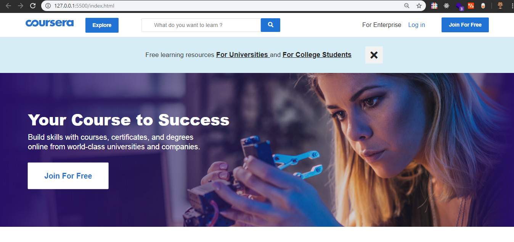

### Day 3: 
**Today's Progress**:
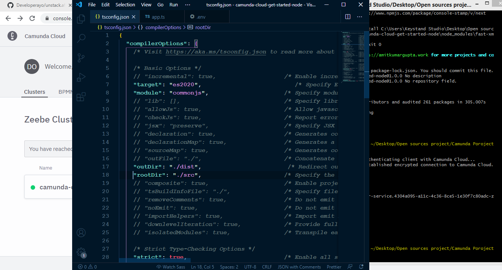

### Day 4: 
**Today's Progress**: 

### Day 5: 
**Today's Progress**: 
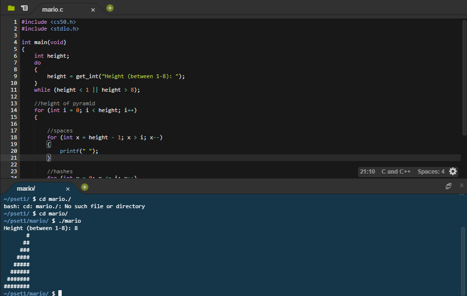

### Day 6: 
**Today's Progress**: 
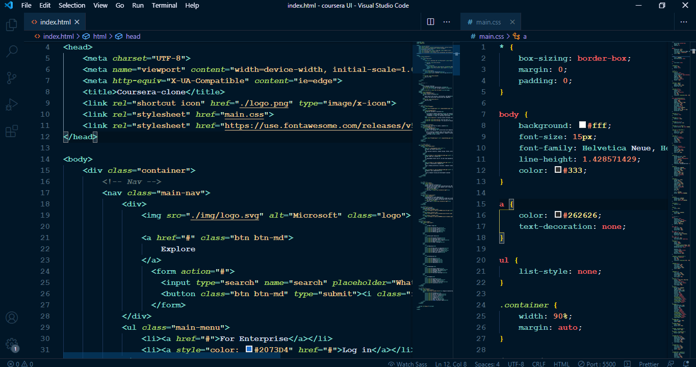

### Day 7: 
**Today's Progress**: 
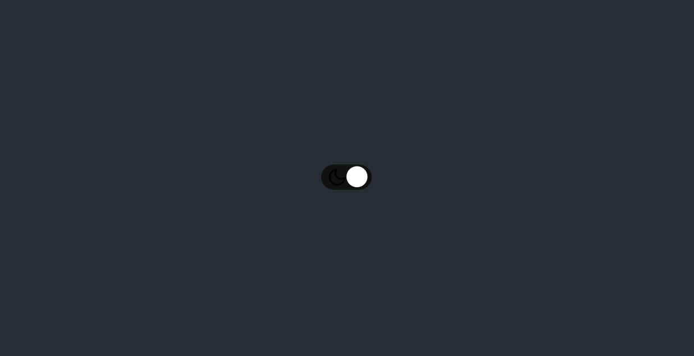

### Day 8: 
**Today's Progress**: 
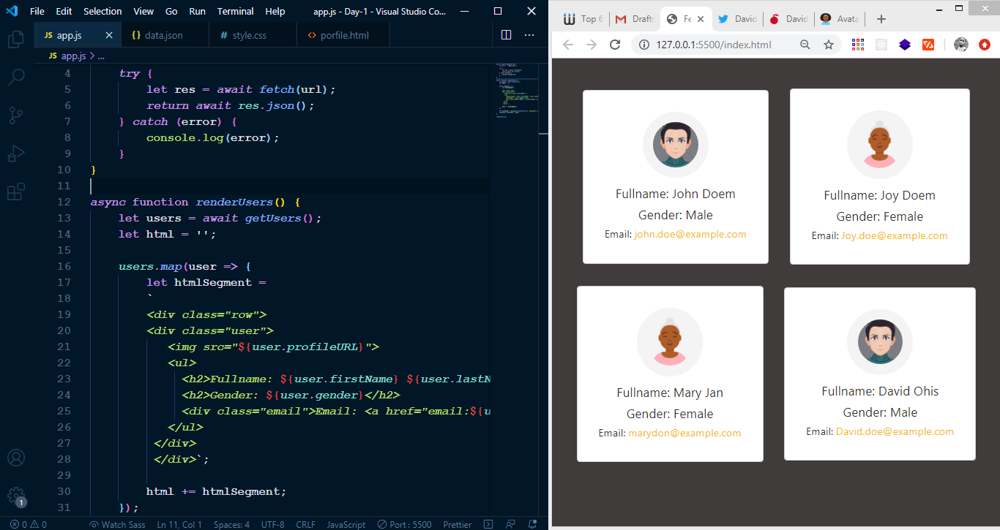

### Day 9: 
**Today's Progress**: 
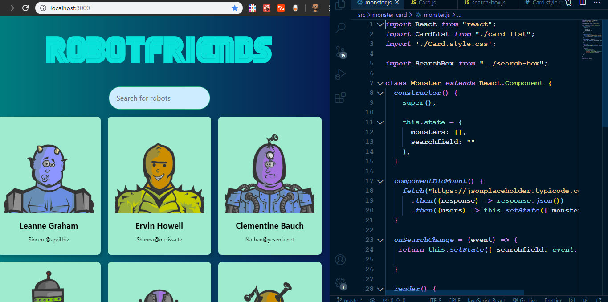

### Day 10: 
**Today's Progress**: 
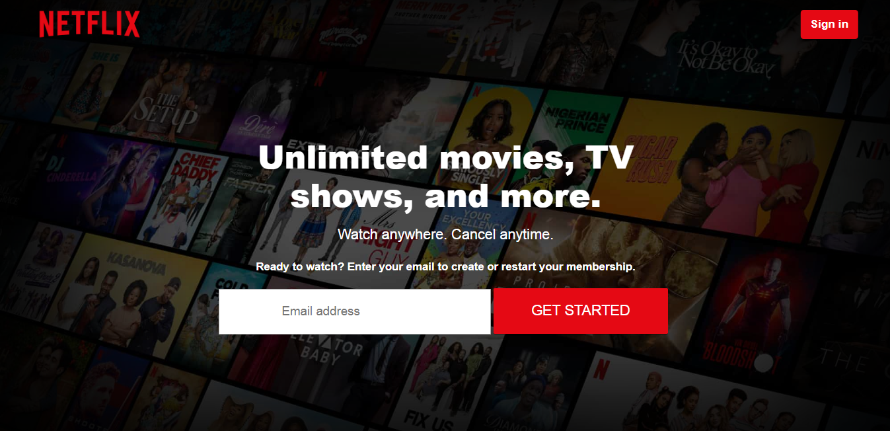

### Day 11: 
**Today's Progress**: 
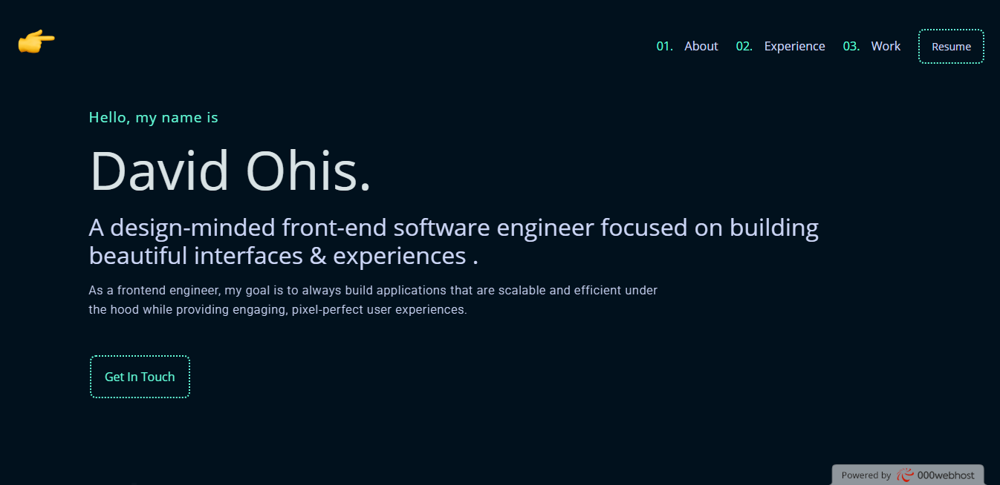

### Day 12: 
**Today's Progress**: 
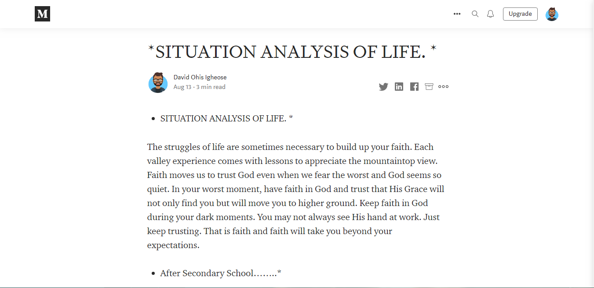

### Day 13: 
**Today's Progress**: 
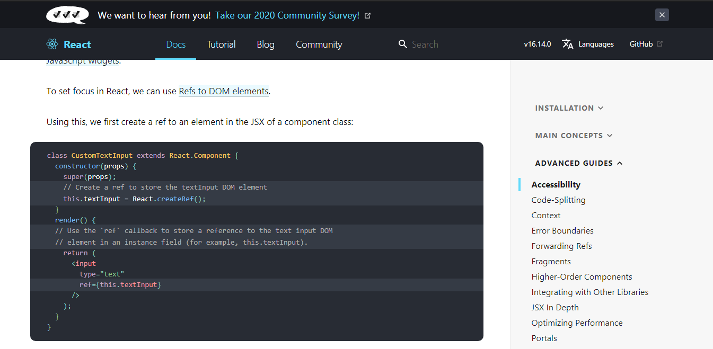

### Day 14: 
**Today's Progress**: 
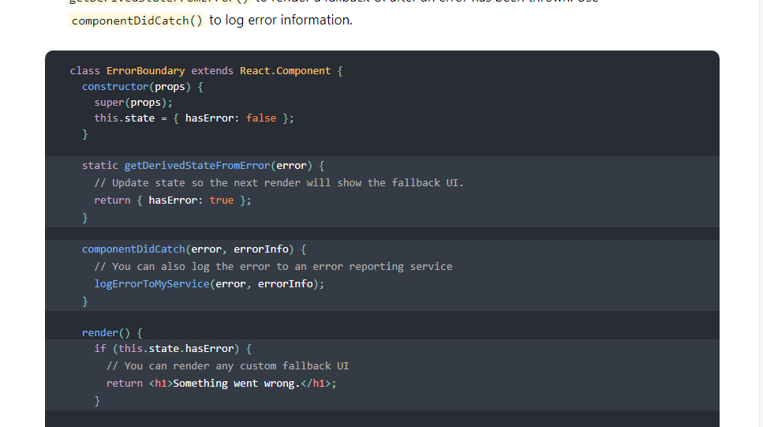

### Day 15:
**Today's Progress**: 

### Day 16:
**Today's Progress**: 
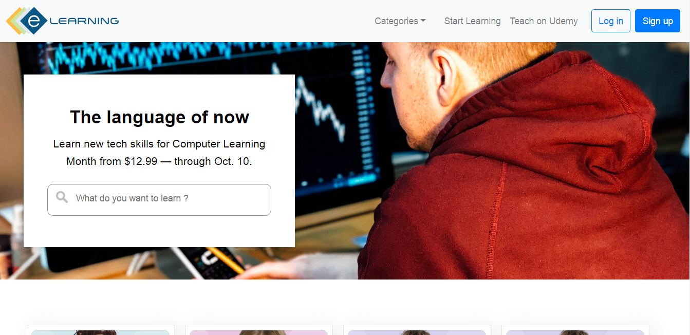

### Day 17:
**Today's Progress**: **Responsive web Design Certification (freeCodeCamp)**
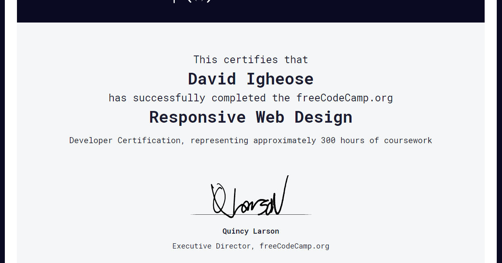

## Day 18:
**Today's Progress**: 
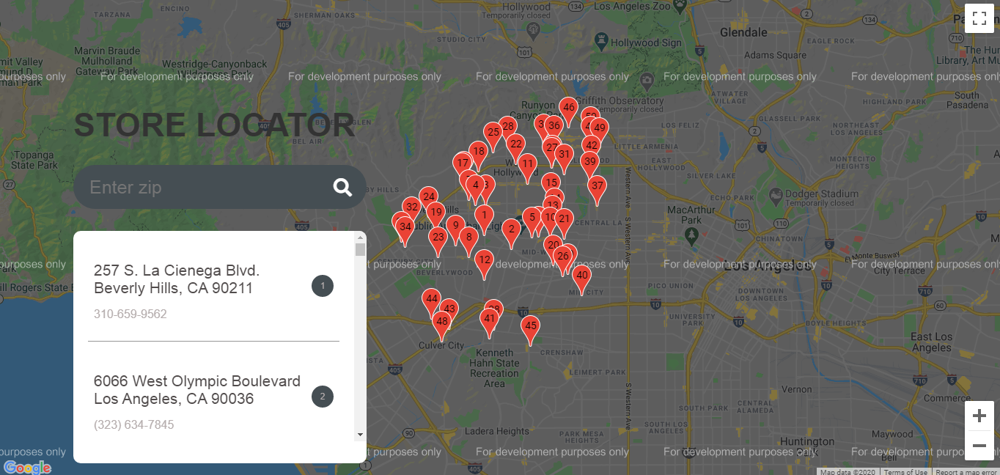

## Day 19:
**Today's Progress**: 
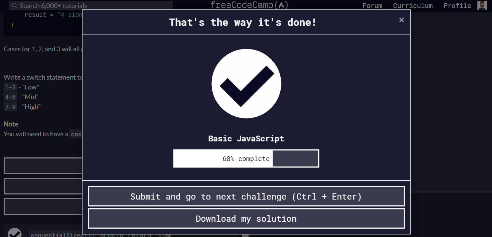

## Day 20:
**Today's Progress**: 
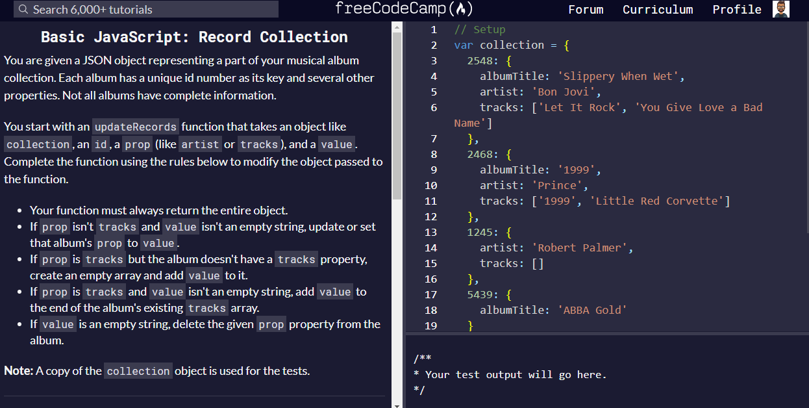

## Day 21:
**Today's Progress**: 
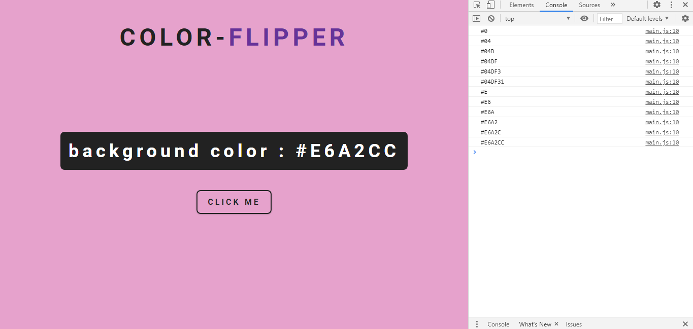

## Day 22:
**Today's Progress**: 
